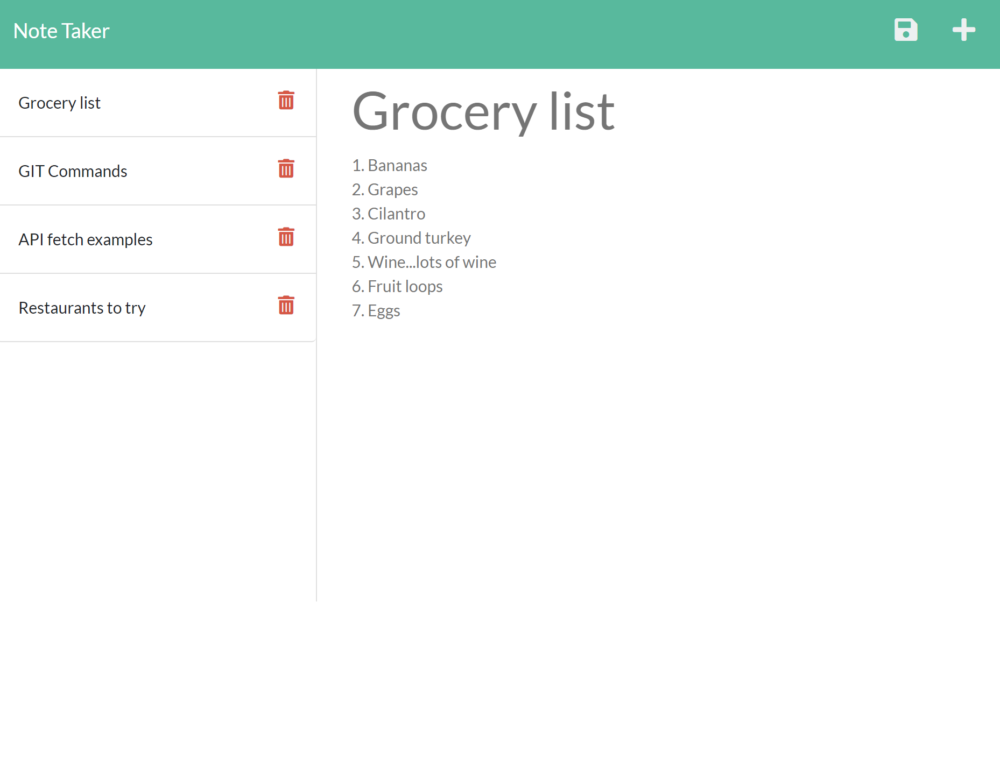

# Note Taker
Create, view, and delete notes on this server side application. View them from any device at anytime!
<br>
View it on Heroku [here](https://note-taker-31119.herokuapp.com/)
<br><br>
**AFTER DELETING a note, close the page and open it again to see the changes**

## 🚚 Getting it up and running
If you would like to have a local copy and create your own server, follow the steps:
1. Clone the codebase from the [repo](https://github.com/mpityo/Note-Taker).
2. Query to the root file directory in any command prompt
3. Run the following command to install required packages:
```
npm install
```
4. Start the server:
```
node server
```
5. Go to your <heavy>localhost</heavy> with port of <heavy>3001</heavy>:
```
localhost:3001
```

## :memo: Features
 - Access notes from any internet connected device
 - Lightweight with base functionality
 - Easy to upgrade and make your own

 ## 🚧 TO-DO
 This is a MVP, much to be upgraded changed
 - Once a note is deleted, update the list in real time instead of having to restart the server to view changes
 - Ability to edit notes
 - User accounts for individual notes
 - Categories to sort and organize
 
## :trophy: Credit
Project idea, front end and majority of back end functionality by @UCFBootCampt
<br>
Routing and server-side functionality by yours truly, @mpityo
<br>
<br>
Project is fully open source: explore the code and upgrade away!
<br>
<br>


